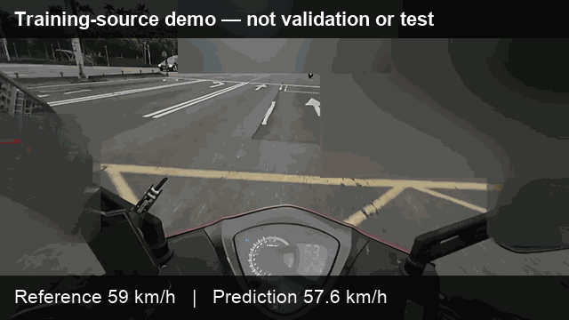

# 單眼騎乘影像逐幀車速估測

[](https://github.com/Drunk-Engineer/monocular-video-speed-estimation/actions/workflows/ci.yml)
[](LICENSE)
[](MODEL_LICENSE.md)
[](https://doi.org/10.5281/zenodo.21604583)

本專案使用隨機初始化的 R3D-18 與 Dilated TCN，從完整單眼騎乘畫面逐幀估測車速。

> **研究發布聲明：** v1.0.0 僅具 validation-only 性質，不能證明模型能泛化至不同路線、攝影機、天候或裝置，也不可用於執法、認證測速或安全關鍵控制。

[English README](README.md)



## 收錄內容

- 將 30 fps 完整影像整理為 30 幀、224×224 的模型輸入；
- 對私下成對錄製的 GPS 顯示畫面執行 OCR 與參考標籤清理；
- R3D-18 加時間卷積網路的訓練與評估；
- 使用重疊視窗及三角權重進行逐幀推論融合；
- 透過 GitHub Release 提供可在 CPU 載入的正式 checkpoint；
- 一段匿名 10 秒影片、結果 CSV 與 GIF。

模型只接收 RGB 影像，不接收 GPS 數值。但完整畫面保留實體儀表，模型可能以儀表讀值作為捷徑；解讀結果時必須保留此限制。

## Validation 結果

主要結果為論文 validation split 的未校正逐幀指標。

| 結果 | MAE (km/h) | RMSE (km/h) | Bias (km/h) | R² | Pearson r |
| --- | ---: | ---: | ---: | ---: | ---: |
| 未校正，主要結果 | 1.809 | 2.923 | -1.003 | 0.991 | 0.996 |
| 使用同一 validation set 校正，補充結果 | 1.838 | 2.700 | -0.001 | 0.993 | 0.996 |

第二列的仿射校正器由同一 validation set 擬合，因此不是獨立評估。本版也沒有收錄完整的獨立 test 輸出。適用範圍與限制請見 [MODEL_CARD.md](MODEL_CARD.md)。

## 安裝

需要 Python 3.11–3.13 與 FFmpeg，建議使用全新虛擬環境：

```bash
git clone https://github.com/Drunk-Engineer/monocular-video-speed-estimation.git
cd monocular-video-speed-estimation
python -m venv .venv
source .venv/bin/activate
python -m pip install --upgrade pip
python -m pip install -e .
```

Windows 請使用 `.venv\Scripts\activate` 啟用環境。

下載 v1.0.0 模型：

```bash
monocular-speed download-weights \
  --version v1.0.0 \
  --output checkpoints
```

checkpoint 超過 GitHub 一般 Git 單檔限制，因此只放在 Release，不寫入 Git 歷史。使用前請依同一 Release 的 `SHA256SUMS.txt` 驗證檔案。

## 執行公開示範

```bash
monocular-speed infer \
  --input sample_data/anonymized_demo.mp4 \
  --checkpoint checkpoints/r3d18_tcn_thesis_v1.0.0.pt \
  --output outputs/demo
```

示範源自訓練素材，只用於確認安裝與推論流程，不是 validation 或 test 證據。公開 CSV 僅有相對欄位：

```text
frame_index,timestamp_s,reference_speed_kmh,predicted_speed_kmh
```

## 指令介面

```bash
monocular-speed extract-labels --video-gps VIDEO --output LABELS
monocular-speed prepare --video VIDEO --labels LABELS --output DATASET
monocular-speed train --config configs/thesis_r3d18_tcn.yaml
monocular-speed infer --input VIDEO --checkpoint MODEL --output OUTPUT
monocular-speed evaluate --predictions PREDICTIONS --labels LABELS --output OUTPUT
monocular-speed download-weights --version v1.0.0 --output checkpoints
```

校正功能預設關閉。只有在能接受且會明確揭露「同一 validation set 校正」限制時才應啟用。重現設定與輸出格式請見 [docs/reproducibility.md](docs/reproducibility.md)。

OCR 標籤仍須人工核對；公開指令會使用多種 Tesseract 影像變體、時間濾波與雙向速度變化限制，但不會把自動 OCR 直接宣稱為 ground truth。`extract-labels` 另需先執行 `python -m pip install -e ".[ocr]"`，並確保系統的 Tesseract 執行檔可由 `PATH` 找到。

## 資料與隱私

本專案不公開完整影片、GPS 顯示版影片、精確路線、完整標籤序列或論文 PDF。公開示範已移除音訊、拍攝時間、GPS 座標、原始檔名及來源絕對時間，並檢視車牌、人臉、可辨識位置文字與路線線索。

研究資料共 12 部影片，來自北臺灣單一固定、約 15 km 的都市通勤路線及同一攝影配置。參考速度由 GPS 顯示 OCR 與清理產生，估計存在約八幀相對延遲。詳見 [DATA_CARD.md](DATA_CARD.md)。

## 引用

機器可讀的引用資料位於 [CITATION.cff](CITATION.cff)。建議學術引用：

> Chen, Ke-Jie. *Per-Frame Vehicle Speed Estimation from Monocular Dashcam
> Videos Using 3D Convolutional Neural Networks*. Master's thesis, Department
> of Computer Science, National Taipei University of Education, July 2026.

v1.0.0 軟體封存版本：[https://doi.org/10.5281/zenodo.21604583](https://doi.org/10.5281/zenodo.21604583)。

## 授權與聯絡

- 程式碼與文件：[MIT](LICENSE)
- 正式權重：[CC BY 4.0](MODEL_LICENSE.md)
- 公開示範 MP4、CSV 與 GIF：[CC BY 4.0](DATA_LICENSE.md)
- 相依套件：[第三方聲明](THIRD_PARTY_NOTICES.md)

聯絡人：[Ke-Jie Chen](mailto:odinswim1990@icloud.com)
